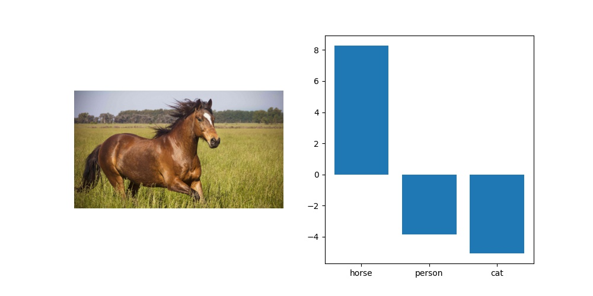

# pascal-voc-caffemodel-pytorch
Port of the original [Pascal VOC 2012 multilabel classification caffemodel](https://github.com/BVLC/caffe/wiki/Model-Zoo#pascal-voc-2012-multilabel-classification-model) to pytorch

## Usage

```python 
from pascal_voc_pytorch.prediction_pipeline  import PascalVOCPredictionPipeline

P = PascalVOCPredictionPipeline(
    checkpoint = 'checkpoints/model.pt',
    device = 'cuda'
)
```

Running inference directly from image files:

```python 
results = P.predict_from_filename(
    filename = 'images/horse.jpg',
    topk = 3   ## returns top 3 classes 
)
```

`results` would look something like: 

```
{
    'classnames': ['horse', 'person', 'cat'], 
    'logits': [8.260506629943848, -3.8401999473571777, -5.0498270988464355]
}
```

## Plotting results 

```python
import matplotlib.pyplot as plt

fig, ax = plt.subplots(nrows=1, ncols=2, figsize = (10 , 5))

ax[0].imshow(plt.imread('images/horse.jpg')), ax[0].axis('off')
ax[1].bar(results['classnames'] ,results['logits'])

fig.savefig('out.jpg')
```


